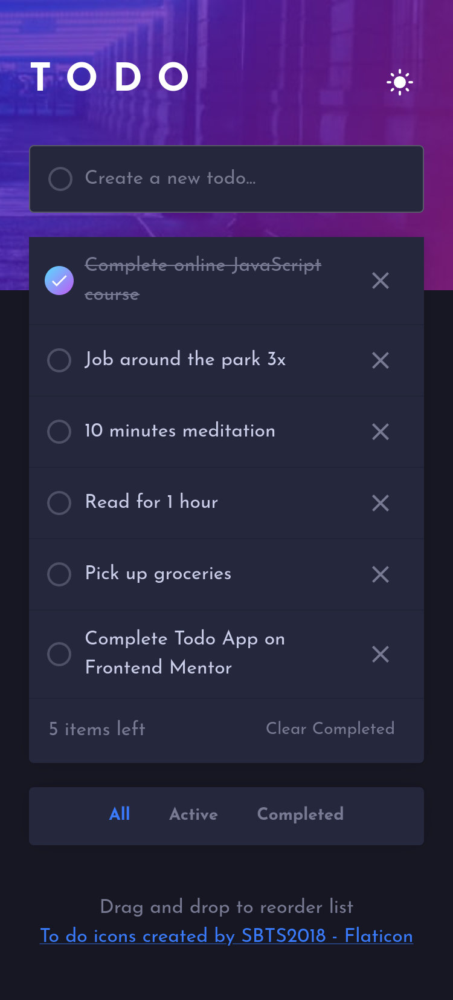

# Frontend Mentor - Todo app solution

This is a solution to the [Todo app challenge on Frontend Mentor](https://www.frontendmentor.io/challenges/todo-app-Su1_KokOW). Frontend Mentor challenges help you improve your coding skills by building realistic projects.

## Overview

### The challenge

Users should be able to:

-   View the optimal layout for the app depending on their device's screen size
-   See hover states for all interactive elements on the page
-   Add new todos to the list
-   Mark todos as complete
-   Delete todos from the list
-   Filter by all/active/complete todos
-   Clear all completed todos
-   Toggle light and dark mode
-   **Bonus**: Drag and drop to reorder items on the list

### Screenshot

### Links

-   Solution URL: [https://www.frontendmentor.io/solutions/lightweight-todo-list-that-works-offline-mNku3J1sIJ](https://www.frontendmentor.io/solutions/lightweight-todo-list-that-works-offline-mNku3J1sIJ)
-   Live Site URL: [https://erlynascarate.github.io/todo-app/](https://erlynascarate.github.io/todo-app/)

## My process

### Built with

-   Mobile-first workflow
-   Redux / Toolkit
-   [Vite](https://vitejs.dev/)
-   [React](https://react.dev/) - JS library
-   [Material UI](https://mui.com/) - UI library
-   [TypeScript](https://www.typescriptlang.org/)
-   [PWA Vite Plugin](https://vite-pwa-org.netlify.app/)
-   [React Beautiful dnd](https://github.com/atlassian/react-beautiful-dnd) - Beautiful and accessible drag and drop for lists with React

### Useful resources

-   [IndexedDB Course for Web Dev by ChatGPT](https://chat.openai.com/share/8e9284ff-25e6-4264-8420-839663b16a8c) - This is an amazing article which helped me finally understand IndexedDB. I'd recommend it to anyone still learning this concept.

## Author

-   Frontend Mentor - [@erlynascarate](https://www.frontendmentor.io/profile/erlynascarate)
-   Twitter - [@erlynascarate](https://www.twitter.com/erlynascarate)
